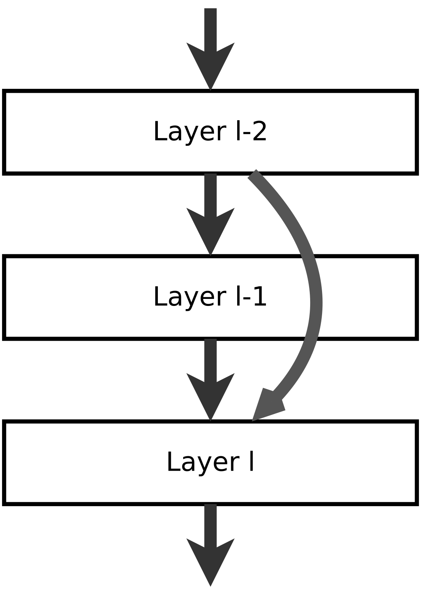

# Emotions
In this notebook I explore some deep learning techniques for detection and classification purposes. The dataset deployed consists of some image pixels and 15 different key points for each image. The dataset is used to train ResNet for detecting the keypoints. 

ResNet is a very powerful architecture which exploits the identity mappings on top of CNN and by using skipping connections property it deals with the impacts of vanishing gradients.

