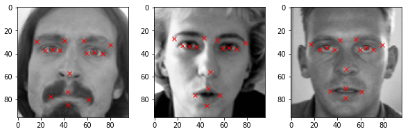
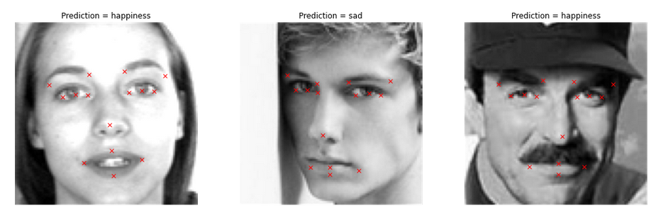

# Emotions
In this notebook I explore some deep learning techniques for detection and classification purposes. The dataset consists of some image pixels and 15 different key points for each image. The dataset is used to train ResNet for detecting the keypoints. 

ResNet is a very powerful architecture which exploits the identity mappings on top of CNN and by using skipping connections property it deals with the impacts of vanishing gradients.

  

In the second part another dataset is used which contains images of different emotions with labels. In this case ResNet is used for classification. Finally both architechtures are combined to detect keypoints and then classify the images according to different expressions. The results are plotted below

The project has been developed in the frame of an udemy course I took on Modern AI Masterclass. 
